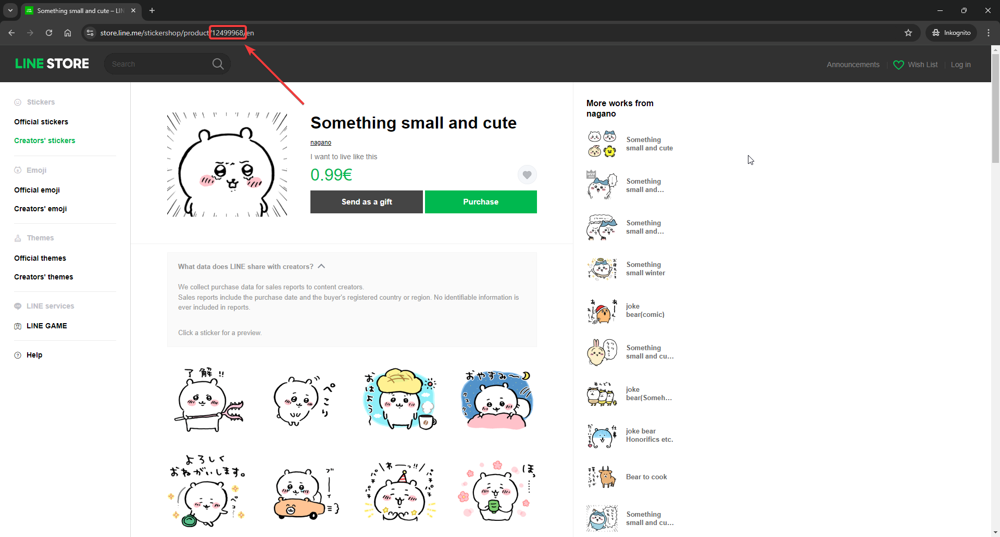
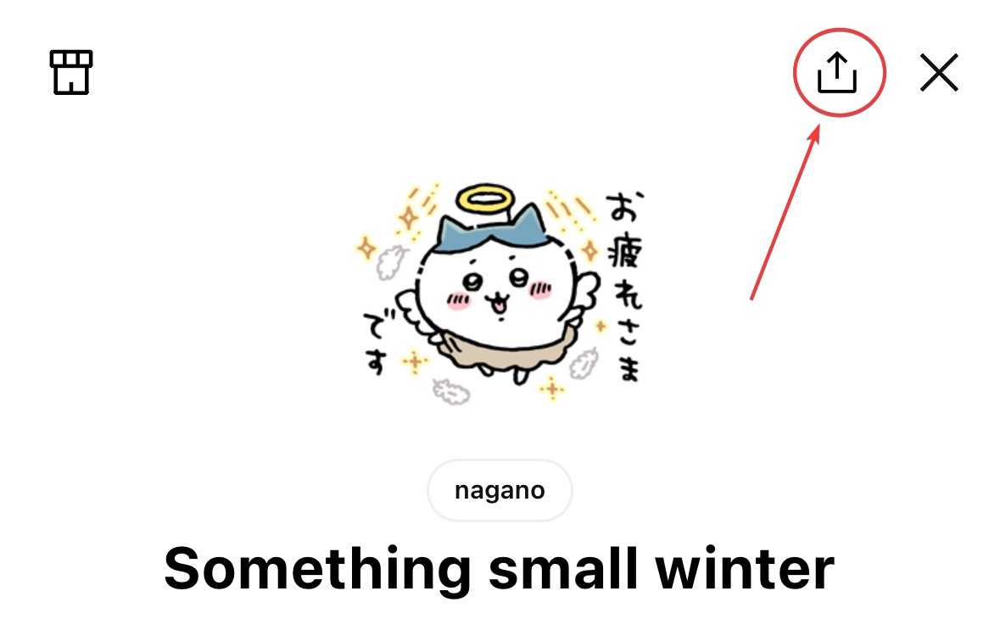

# StickerFetch - a LINE sticker downloader

Sticker Fetch is a command-line utility for downloading stickers from the LINE messaging app, written in Rust. This program allows users to download both static PNG stickers and animated GIFs from a specified sticker pack. It organizes downloaded stickers into a directory named after the sticker pack.

## Features

- Download static PNG stickers.
- Download animated stickers as GIFs.
- Save all stickers in a directory named after the sticker pack.

## Requirements

- **FFmpeg**: This tool is required for converting APNG files to GIFs. You can download FFmpeg from [ffmpeg.org](https://ffmpeg.org/download.html). _**Windows Users**_: Make sure `ffmpeg` is in your system's PATH.

## Download and Usage

1. **Download the Executable**:

   Download the latest release from [here](https://github.com/yourusername/line-downloader/releases) and save it to a location where you want to save your stickers to.

2. **Run the Program**:

   After downloading the executable, navigate to the directory where the executable is located.

   **On Windows**:

   Open Command Prompt and run:
   ```sh
   StickerFetch.exe
   ```
   
    **On macOS/Linux**:
    
    Open the terminal and run:
    ```sh
    ./StickerFetch
    ```

3. **Input Sticker Pack ID:**

    You will be prompted to enter the ID of the sticker pack you want to download. Enter the ID and press Enter.

4. **Select File Type**:

    After entering the sticker pack ID you can choose the file type:

    - **_PNG_**: Download only static PNG stickers.
    - **_GIF_**: Download only animated stickers as GIFs.
    - **_Both_**: Download both static PNG stickers and animated stickers as GIFs.

    If the sticker pack only contains static stickers the file type selection will be skipped
    and directly download the stickers as PNGs.

## Finding the Sticker Pack ID

To find the Sticker Pack ID, follow these steps:

**On a PC:**

1. Go to the Line Store or Line app and find the sticker pack you want to download.
2. Look at the URL or the product details for the pack ID.

**Example:** The URL `https://store.line.me/stickershop/product/1234567/en` has the Sticker Pack ID `1234567`.




**In the mobile app:**

1. Open the sticker pack in the LINE Store in your app.
2. Click the "Share" Button and copy the link. Then paste it into a note or any other text file/field and look for the
ID like you would on a pc.




## Future Plans

- support batch downloads
- support for downloading Telegram sticker packs
- GUI version

## Contributing

Contributions are welcome! Please open an issue or submit a pull request for any improvements or features you'd like to see.

## Disclaimer

This tool is provided "as is" without any warranties or guarantees. The creator of this tool is not liable for any actions taken by users of this tool. Users are responsible for ensuring that their use of this tool complies with all applicable laws and terms of service.

## License

This project is licensed under the MIT License. See the [LICENSE](LICENSE.md) file for details.